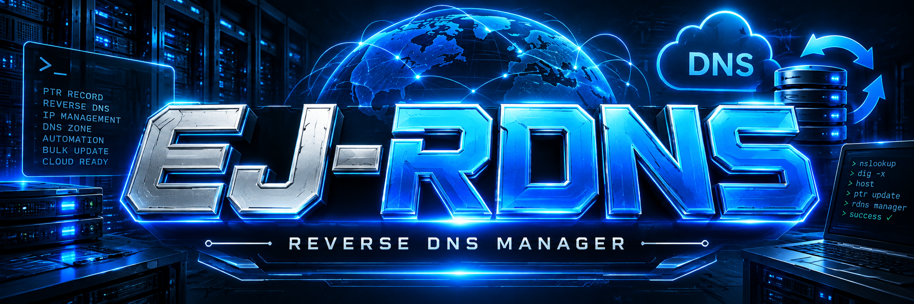

# 🚀 RDNS Manager by ejaywattapak


<p align="center">
  
</p>


## ✨ Features

- 🔐 Mutual TLS authentication
- 🌐 DNS interception
- 🔎 SNI interception
- ⚡ QUIC interception
- 🛡️ Automatic nftables redirects
- 🔄 Automatic tunnel connection
- 📋 Rule-based domain routing
- ⚙️ systemd service integration

## 🖥️ Supported OS

| OS | Status |
|---|---|
| Debian 13 | ✅ Supported |
| Debian 12 | ✅ Supported |
| Ubuntu 24.04 LTS | ✅ Supported |


## 🚀 Installation

### Copy & Paste

```bash
apt-get install -y wget && wget -qO installer.sh https://raw.githubusercontent.com/ejaywattapak/rdns-manager/main/installer.sh && bash installer.sh
```

## 🔐 Security

The RDNS client uses mutual TLS authentication.

Keep private keys and other sensitive credentials outside the public repository. This repository intentionally does not include private `.key` files.


## 👤 Author

**EJAYWATTAPAK**

---

<p align="center">
  RDNS Manager • Smart RDNS Routing
</p>
